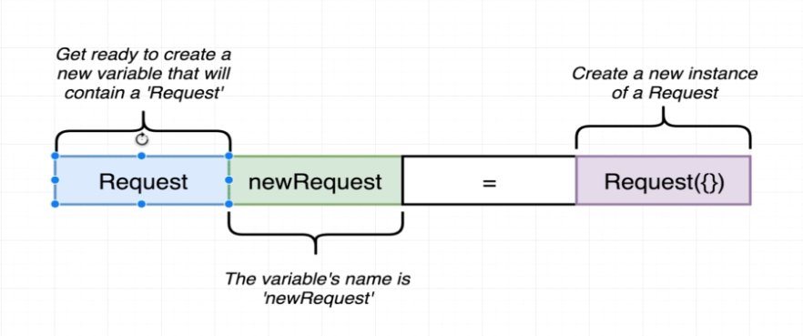

# 124. Instance Creation Syntax

**Campaign.sol** - Instance Creation Syntax
```
pragma solidity ^0.4.17;

contract Campaign {
    struct Request {
        string description;
        uint value;
        address recipient;
        bool complete;
    }

    Request [] public requests;
    address public manager;
    uint public minimumContribution;
    address[] public approvers;

    modifier restricted() {
        require(msg.sender == manager);
        _;
    }

    constructor (uint minimum) public {    
        manager = msg.sender;
        minimumContribution = minimum;
    }

    function contribute() public payable {
        require (msg.value > minimumContribution);

        approvers.push(msg.sender);
    }

    function createRequest(string description, uint value, address recipient) public restricted {
        Request newRequest = Request ({
            description: description,
            value: value,
            recipient: recipient,
            complete: false
            
        });

        // Request(description, value, recipient, false);

        requests.push(newRequest) ;
    }
}
```


---

<details>
  <summary>Compile - issues</summary>


---
**contracts/3_Ballot.sol:33:9: Warning:**
```
contracts/3_Ballot.sol:33:9: Warning: Variable is declared as a storage pointer. Use an explicit "storage" keyword to silence this warning.
Request newRequest = Request ({
^----------------^
```
**contracts/3_Ballot.sol:33:9: TypeError:**
```
contracts/3_Ballot.sol:33:9: TypeError: Type struct Campaign.Request memory is not implicitly convertible to expected type struct Campaign.Request storage pointer.
Request newRequest = Request ({
^ (Relevant source part starts here and spans across multiple lines).
```

- [What does the keyword "memory" do exactly?](https://ethereum.stackexchange.com/questions/1701/what-does-the-keyword-memory-do-exactly)
</details>  