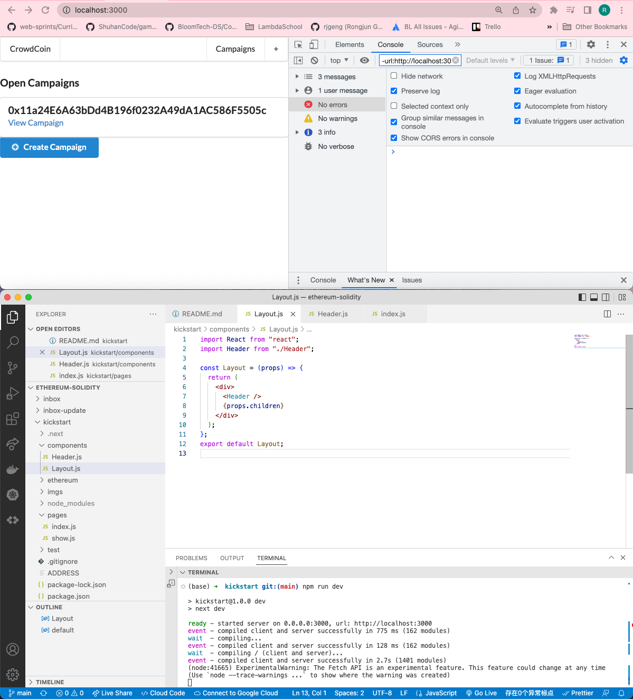

# 180. Assembling a Header

**Create components/Header.js**
```
import React from "react";
import { Menu } from "semantic-ui-react";

const Header = () => {
  return (
    <Menu>
      <Menu.Item>CrowdCoin</Menu.Item>

      <Menu.Menu position="right">
        <Menu.Item>Campaigns</Menu.Item>
        <Menu.Item>+</Menu.Item>
      </Menu.Menu>
    </Menu>
  );
};

export default Header;
```

<details>
  <summary>Assembling a Header - result capture</summary>

**components/Layout.js** - update
```
import React from "react";
import Header from "./Header";

const Layout = (props) => {
  return (
    <div>
      <Header />
      {props.children}
    </div>
  );
};
export default Layout;
```  

**pages/index.js**
```
import React, { Component } from "react";
import { Card, Button } from "semantic-ui-react";
import factory from "../ethereum/factory";
import Layout from "../components/Layout";

class CampaignIndex extends Component {
  static async getInitialProps() {
    const campaigns = await factory.methods.getDeployedCampaigns().call();

    return { campaigns };
  }
  renderCampaigns() {
    const items = this.props.campaigns.map((address) => {
      return {
        header: address,
        description: <a>View Campaign</a>,
        fluid: true,
      };
    });
    return <Card.Group items={items} />;
  }
  render() {
    return (
      <Layout>
        <div>
          <link
            rel="stylesheet"
            href="//cdnjs.cloudflare.com/ajax/libs/semantic-ui/2.2.12/semantic.min.css"
          ></link>
          <h3>Open Campaigns</h3>
          {this.renderCampaigns()}
          <Button content="Create Campaign" icon="add circle" primary />
        </div>
      </Layout>
    );
  }
}

export default CampaignIndex;
```  


---
</details>

##  Resources for this lecture

---

-   [184-assembling.zip](https://beatlesm.s3.us-west-1.amazonaws.com/ethereum-and-solidity-complete-developer-guide/184-assembling.zip)