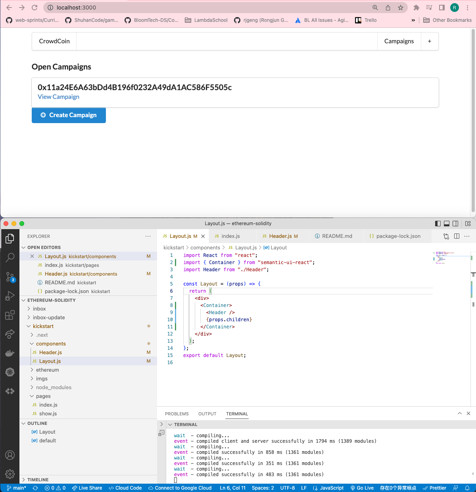
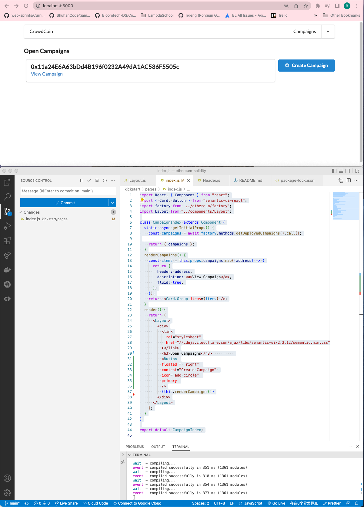

# 182. Two Column Layout

<details>
  <summary>Two Column Layout - result capture</summary>

`pages/index.js`
```
import React, { Component } from "react";
import { Card, Button } from "semantic-ui-react";
import factory from "../ethereum/factory";
import Layout from "../components/Layout";

class CampaignIndex extends Component {
  static async getInitialProps() {
    const campaigns = await factory.methods.getDeployedCampaigns().call();

    return { campaigns };
  }
  renderCampaigns() {
    const items = this.props.campaigns.map((address) => {
      return {
        header: address,
        description: <a>View Campaign</a>,
        fluid: true,
      };
    });
    return <Card.Group items={items} />;
  }
  render() {
    return (
      <Layout>
        <div>
          <link
            rel="stylesheet"
            href="//cdnjs.cloudflare.com/ajax/libs/semantic-ui/2.2.12/semantic.min.css"
          ></link>
          <h3>Open Campaigns</h3>          
          <Button 
          floated = "right" 
          content="Create Campaign" 
          icon="add circle" 
          primary 
          />
          {this.renderCampaigns()}
        </div>
      </Layout>
    );
  }
}

export default CampaignIndex;

```  
---


---

---
</details>  

##  Resources for this lecture

---

-   [186-two-column.zip](https://beatlesm.s3.us-west-1.amazonaws.com/ethereum-and-solidity-complete-developer-guide/186-two-column.zip)