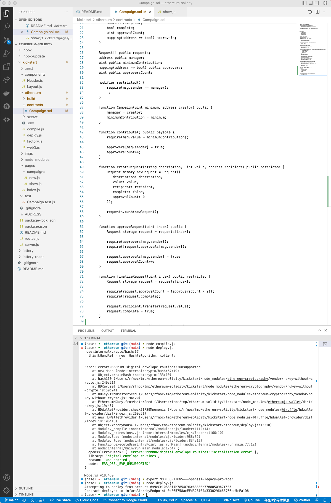

# 200. Redeploying CampaignFactory

<details>
  <summary>Redeploying CampaignFactory - result capture</summary>

**ethereum/contracts/Campaign.sol** -  Redeploying CampaignFactory
```
pragma solidity ^0.4.17;

contract CampaignFactory {
    address[] public deployedCampaigns;

    function createCampaign(uint minimum) public {
        address newCampaign = new Campaign(minimum, msg.sender);
        deployedCampaigns.push(newCampaign);
    }

    function getDeployedCampaigns() public view returns (address[]) {
        return deployedCampaigns;
    }
}

contract Campaign {
    struct Request {
        string description;
        uint value;
        address recipient;
        bool complete;
        uint approvalCount;
        mapping(address => bool) approvals;
    }

    Request[] public requests;
    address public manager;
    uint public minimumContribution;
    mapping(address => bool) public approvers;
    uint public approversCount;

    modifier restricted() {
        require(msg.sender == manager);
        _;
    }

    function Campaign(uint minimum, address creator) public {
        manager = creator;
        minimumContribution = minimum;
    }

    function contribute() public payable {
        require(msg.value > minimumContribution);

        approvers[msg.sender] = true;
        approversCount++;
    }

    function createRequest(string description, uint value, address recipient) public restricted {
        Request memory newRequest = Request({
           description: description,
           value: value,
           recipient: recipient,
           complete: false,
           approvalCount: 0
        });

        requests.push(newRequest);
    }

    function approveRequest(uint index) public {
        Request storage request = requests[index];

        require(approvers[msg.sender]);
        require(!request.approvals[msg.sender]);

        request.approvals[msg.sender] = true;
        request.approvalCount++;
    }

    function finalizeRequest(uint index) public restricted {
        Request storage request = requests[index];

        require(request.approvalCount > (approversCount / 2));
        require(!request.complete);

        request.recipient.transfer(request.value);
        request.complete = true;
    }
    
    function getSummary() public view returns (
      uint, uint, uint, uint, address
      ) {
        return (
          minimumContribution,
          this.balance,
          requests.length,
          approversCount,
          manager
        );
    }
    
    function getRequestsCount() public view returns (uint) {
        return requests.length;
    }
}
```

**node compile.js**
```
cd / ethereum
```
```
node compile.js
```

**node deploy.js**
```
node deploy.js
```


---
address - Contract deployed to:
```
0x865758acEFd32B10fa3330296b88766cc5cFa1D8
```
**ethereum/factory.js** - update the address
address - Contract deployed to:
```
0x865758acEFd32B10fa3330296b88766cc5cFa1D8
```
**Run server**
```
cd ..
npm run dev
```
</details>

##  Resources for this lecture

---

-   [204-redeploying.zip](https://beatlesm.s3.us-west-1.amazonaws.com/ethereum-and-solidity-complete-developer-guide/204-redeploying.zip)