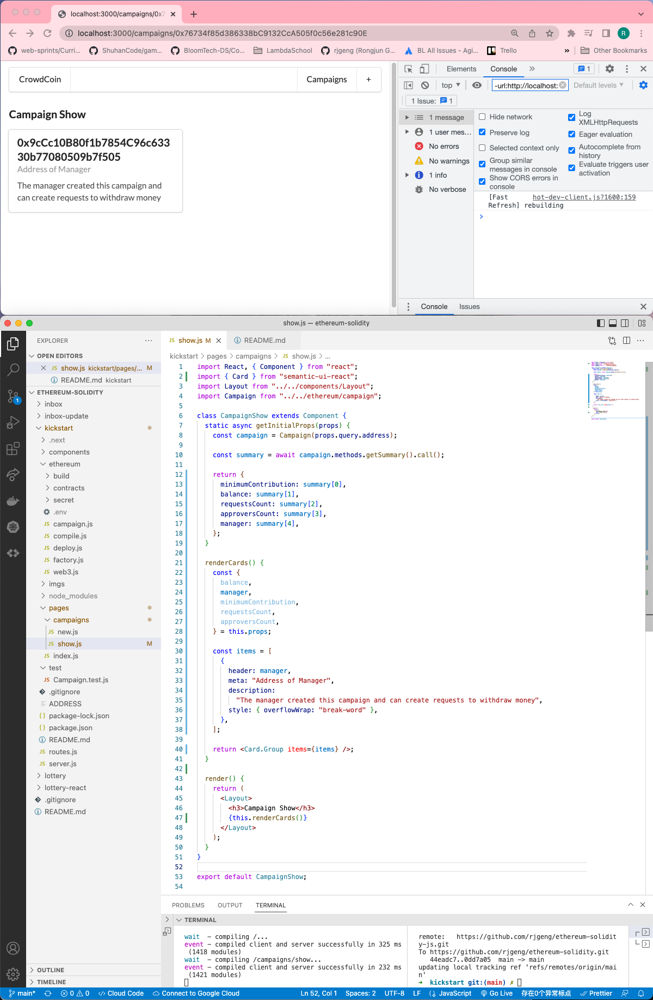

# 204. Custom Card Groups

**pages/campaigns/show.js** - Custom Card Groups
```
import React, { Component } from "react";
import { Card } from "semantic-ui-react";
import Layout from "../../components/Layout";
import Campaign from "../../ethereum/campaign";

class CampaignShow extends Component {
  static async getInitialProps(props) {
    const campaign = Campaign(props.query.address);

    const summary = await campaign.methods.getSummary().call();

    return {
      minimumContribution: summary[0],
      balance: summary[1],
      requestsCount: summary[2],
      approversCount: summary[3],
      manager: summary[4],
    };
  }

  renderCards() {
    const {
      balance,
      manager,
      minimumContribution,
      requestsCount,
      approversCount,
    } = this.props;

    const items = [
      {
        header: manager,
        meta: "Address of Manager",
        description:
          "The manager created this campaign and can create requests to withdraw money",
        style: { overflowWrap: "break-word" },
      },
    ];

    return <Card.Group items={items} />;
  }

  render() {
    return (
      <Layout>
        <h3>Campaign Show</h3>
        {this.renderCards()}
      </Layout>
    );
  }
}

export default CampaignShow;
```

<details>
  <summary>Custom Card Groups - capture</summary>


---
</details>

##  Resources for this lecture

---

-   [208-custom-card.zip](https://beatlesm.s3.us-west-1.amazonaws.com/ethereum-and-solidity-complete-developer-guide/208-custom-card.zip)