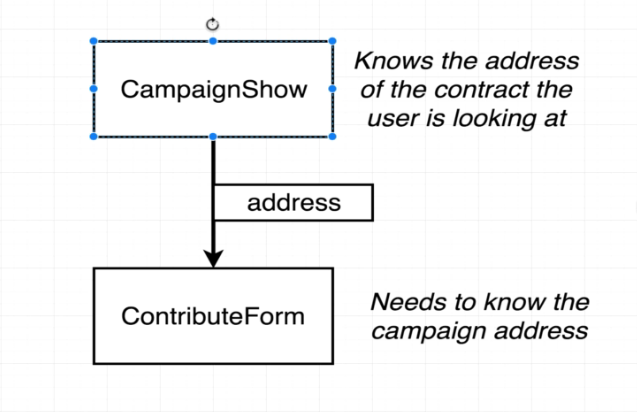

# 209. Communicating the Campaign Address

<details>
  <summary>Communicating the Campaign Address</summary>

**pages/campaigns/show.js** - Communicating the Campaign Address
```
import React, { Component } from "react";
import { Card, Grid } from "semantic-ui-react";
import Layout from "../../components/Layout";
import Campaign from "../../ethereum/campaign";
import web3 from "../../ethereum/web3";
import ContributeForm from "../../components/ContributeForm";  

class CampaignShow extends Component {
  static async getInitialProps(props) {
    const campaign = Campaign(props.query.address);

    const summary = await campaign.methods.getSummary().call();

    return {
      address: props.query.address,  // --- Communicating the Campaign Address
      minimumContribution: summary[0],
      balance: summary[1],
      requestsCount: summary[2],
      approversCount: summary[3],
      manager: summary[4],
    };
  }

  renderCards() {
    const {
      balance,
      manager,
      minimumContribution,
      requestsCount,
      approversCount,
    } = this.props;

    const items = [
      {
        header: manager,
        meta: "Address of Manager",
        description:
          "The manager created this campaign and can create requests to withdraw money",
        style: { overflowWrap: "break-word" },
      },
      {
        header: minimumContribution,
        meta: "Minimum Contribution (wei)",
        description:
          "You must contribute at least this much wei to become an approver",
      },
      {
        header: requestsCount,
        meta: "Number of Requests",
        description:
          "A request tries to withdraw money from the contract. Requests must be approved by approvers",
      },
      {
        header: approversCount,
        meta: "Number of Approvers",
        description:
          "Number of people who have already donated to this campaign",
      },
      {
        header: web3.utils.fromWei(balance, "ether"),
        meta: "Campaign Balance (ether)",
        description:
          "The balance is how much money this campaign has left to spend.",
      },
    ];

    return <Card.Group items={items} />;
  }

  render() {
    return (
      <Layout>
        <h3>Campaign Show</h3>
        <Grid>
          <Grid.Column width={10}>{this.renderCards()}</Grid.Column>
          <Grid.Column width={6}>
          <ContributeForm address={this.props.address} />  // --- Communicating the Campaign Address
          </Grid.Column>
        </Grid>
      </Layout>
    );
  }
}

export default CampaignShow;

```
**components/ContributeForm.js**
```
import React, { Component } from "react";
import { Form, Input, Message, Button } from "semantic-ui-react";
import Campaign from "../ethereum/campaign"; // --- Communicating the Campaign Address

class ContributeForm extends Component {
  state = {
    value: "",
  };

  onSubmit = async (event) => {
    event.preventDefault();

    const campaign = Campaign(this.props.address); // --- Communicating the Campaign Address
    
  };

  render() {
    return (
      <Form onSubmit={this.onSubmit}>
        <Form.Field>
          <label>Amount to Contribute</label>
          <Input
            value={this.state.value}
            onChange={(event) => this.setState({ value: event.target.value })}
            label="ether"
            labelPosition="right"
          />
        </Form.Field>
        <Button primary>Contribute!</Button>
      </Form>
    );
  }
}

export default ContributeForm;

```
</details>


---

