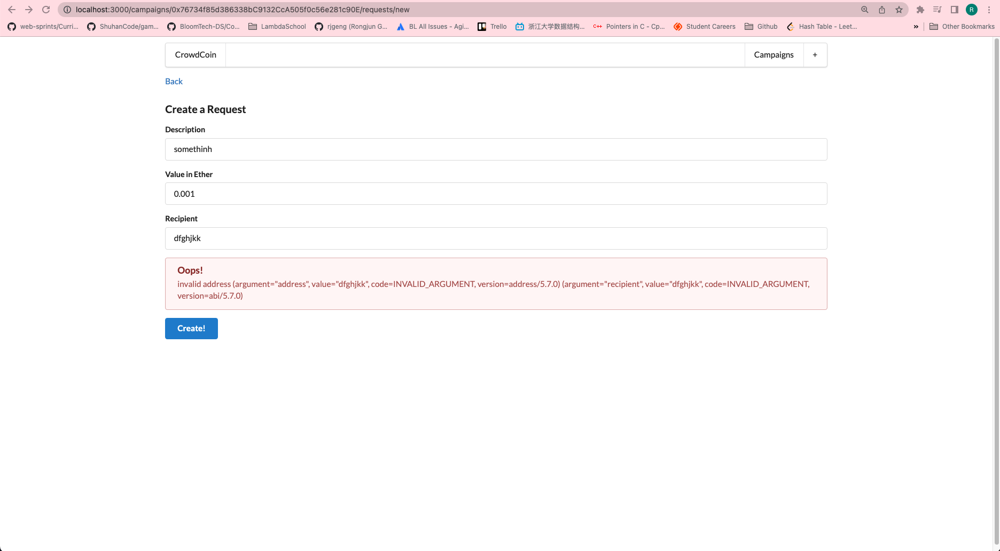
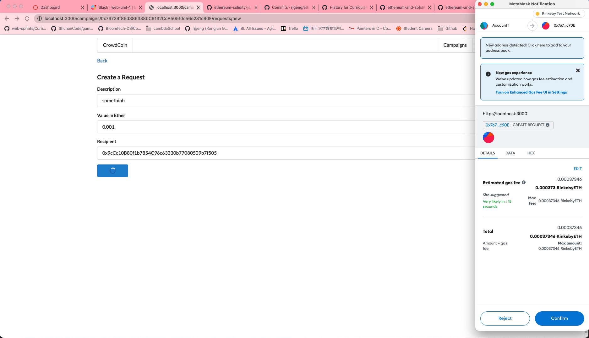
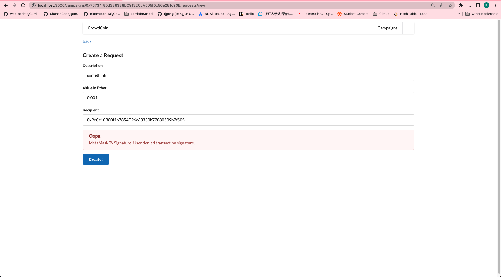

# 218. Form Polish

**pages/campaigns/requests/new.js** - Form Polish
```
import React, { Component } from "react";
import { Form, Button, Message, Input } from "semantic-ui-react";
import Campaign from "../../../ethereum/campaign";
import web3 from "../../../ethereum/web3";
import { Link, Router } from "../../../routes";
import Layout from "../../../components/Layout";

class RequestNew extends Component {
  state = {
    value: "",
    description: "",
    recipient: "",
    loading: false,
    errorMessage: "",
  };

  static async getInitialProps(props) {
    const { address } = props.query;

    return { address };
  }

  onSubmit = async (event) => {
    event.preventDefault();

    const campaign = Campaign(this.props.address);
    const { description, value, recipient } = this.state;

    this.setState({ loading: true, errorMessage: "" });

    try {
      const accounts = await web3.eth.getAccounts();
      await campaign.methods
        .createRequest(description, web3.utils.toWei(value, "ether"), recipient)
        .send({ from: accounts[0] });
      Router.pushRoute(`/campaigns/${this.props.address}/requests`);
    } catch (err) {
      this.setState({ errorMessage: err.message });
    }
    this.setState({ loading: false });
  };

  render() {
    return (
      <Layout>
        <Link route={`/campaigns/${this.props.address}/requests`}>
          <a>Back</a>
        </Link>
        <h3>Create a Request</h3>
        <Form onSubmit={this.onSubmit} error={!!this.state.errorMessage}>
          <Form.Field>
            <label>Description</label>
            <Input
              value={this.state.description}
              onChange={(event) =>
                this.setState({ description: event.target.value })
              }
            />
          </Form.Field>
          <Form.Field>
            <label>Value in Ether</label>
            <Input
              value={this.state.value}
              onChange={(event) => this.setState({ value: event.target.value })}
            />
          </Form.Field>
          <Form.Field>
            <label>Recipient</label>
            <Input
              value={this.state.recipient}
              onChange={(event) =>
                this.setState({ recipient: event.target.value })
              }
            />
          </Form.Field>
          <Message error header="Oops!" content={this.state.errorMessage} />
          <Button primary loading={this.state.loading}>
            Create!
          </Button>
        </Form>
      </Layout>
    );
  }
}

export default RequestNew;
```

<details>
  <summary>Form Polish - capture</summary>

**Note: key in invalid address, then click Create!** 

---
**Note: key in valid address, click reject on metamask** 

---

---
</details>

##  Resources for this lecture

---

-   [222-form-polish.zip](https://beatlesm.s3.us-west-1.amazonaws.com/ethereum-and-solidity-complete-developer-guide/222-form-polish.zip)