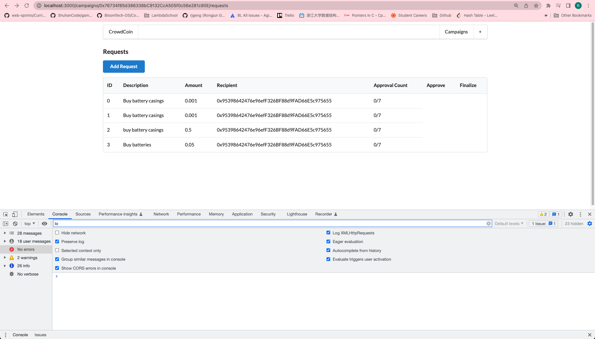

# 226. Approvers Count Cell

**components/RequestRow.js** - Request Row Content
```
import React, { Component } from "react";
import { Table } from "semantic-ui-react";
import web3 from "../ethereum/web3";

class RequestRow extends Component {
  render() {
    const { Row, Cell } = Table;
    const { id, request, approversCount } = this.props;

    return (
      <Row>
        <Cell>{id}</Cell>
        <Cell>{request.description}</Cell>
        <Cell>{web3.utils.fromWei(request.value, "ether")}</Cell>
        <Cell>{request.recipient}</Cell>
        <Cell>
          {request.approvalCount}/{approversCount}
        </Cell>
      </Row>
    );
  }
}
export default RequestRow;
```

**pages/campaigns/requests/index.js** - Request Row Component
```
import React, { Component } from "react";
import { Button, Table } from "semantic-ui-react";
import { Link } from "../../../routes";
import Layout from "../../../components/Layout";
import Campaign from "../../../ethereum/campaign";
import RequestRow from "../../../components/RequestRow";

class RequestIndex extends Component {
  static async getInitialProps(props) {
    const { address } = props.query;
    const campaign = Campaign(address);
    const requestCount = await campaign.methods.getRequestsCount().call();
    const approversCount = await campaign.methods.approversCount().call();

    const requests = await Promise.all(
      Array(parseInt(requestCount))
        .fill()
        .map((element, index) => {
          return campaign.methods.requests(index).call();
        })
    );

    return { address, requests, requestCount, approversCount };
  }

  renderRows() {
    return this.props.requests.map((request, index) => {
      return (
        <RequestRow
          key={index}
          id={index}
          request={request}
          address={this.props.address}
          approversCount={this.props.approversCount}
        />
      );
    });
  }

  render() {
    const { Header, Row, HeaderCell, Body } = Table;

    return (
      <Layout>
        <h3>Requests</h3>
        <Link route={`/campaigns/${this.props.address}/requests/new`}>
          <a>
            <Button primary>Add Request</Button>
          </a>
        </Link>
        <Table>
          <Header>
            <Row>
              <HeaderCell>ID</HeaderCell>
              <HeaderCell>Description</HeaderCell>
              <HeaderCell>Amount</HeaderCell>
              <HeaderCell>Recipient</HeaderCell>
              <HeaderCell>Approval Count</HeaderCell>
              <HeaderCell>Approve</HeaderCell>
              <HeaderCell>Finalize</HeaderCell>
            </Row>
          </Header>
          <Body>{this.renderRows()}</Body>
        </Table>
      </Layout>
    );
  }
}

export default RequestIndex;
```

<details>
  <summary>Approvers Count Cell - capture</summary>


---
</details>

##  Resources for this lecture

---

-   [230-approvers-count.zip](https://beatlesm.s3.us-west-1.amazonaws.com/ethereum-and-solidity-complete-developer-guide/230-approvers-count.zip)